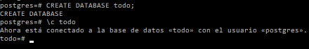
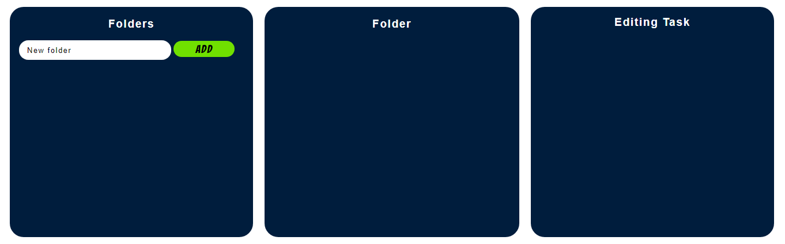
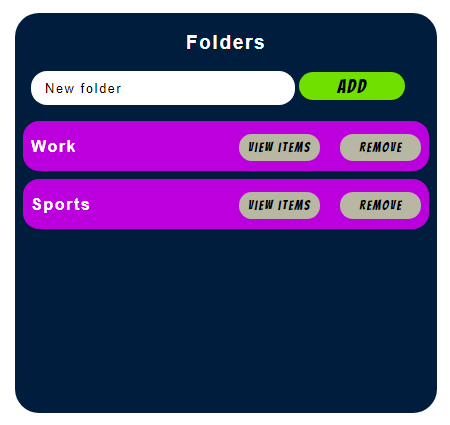
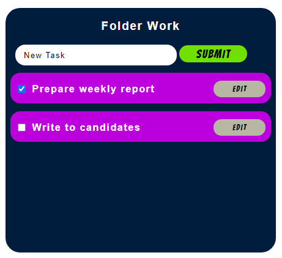
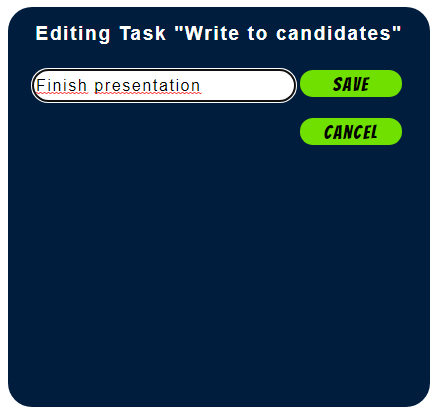
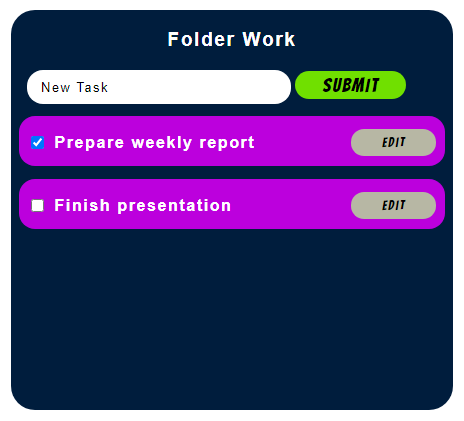
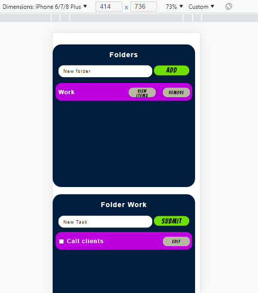

# ToDo-App

Esta es una aplicación que permite crear tareas que debemos realizar. Las mismas, se pueden
almacenar en carpetas para separarlas por tipo. Ademas, podemos seleccionar si la tarea
fue realizada o editar el nombre de la misma. Por último, podemos eliminar una carpeta y al
realizar esto se nos van a eliminar todas las tareas que la componian.

Para realizar esta aplicación, utilice distintas tecnologias:
 
Para el front-end: 

- React ^17.0.1
- Redux ^4.1.2
- CSS
- HTML

Para el back-end:

-Node js >=12.18.3

-Express ^4.17.1

-PostgreSQL v14.1

-Sequelize ^6.3.5

Para instalar las dependencias y poder correr la aplicacion. 

- "npm": ">=6.14.6"

Para poder correr esta aplicacion es necesario instalar las dependencias tanto en el back-end
como en el front-end. Para esto debemos diriginos a la ruta en donde se encuentra el archivo 
"package.json" tanto en la carpeta "client" como en la "api" y ejecutamos el comando "npm
install".

Por otra parte debemos crear la base de datos. Como en este caso se utilizo PostgreSQL,
nos dirigmos a la consola de PostgreSQL y creamos la base de datos con el nombre "todo".
Tener en cuenta, que en el archivo "db.js" que se encuentra en /api/src, tenemos la conexión
de sequelize con la base de datos. Aquí lo que debemos hacer es cambiar los parámetros 
{DB_USER} y {DB_PASSWORD} para que nuestro back-end se pueda conectar a la misma. En la 
siguiente imagen se muestra como fue creada la base de datos. 

Una vez realizado esto, ejecutamos npm start tanto en el back-end como en el front-end y
esto nos va a correr la aplicación en el puerto 3000 de localhost. 

A continuación se muestra algunas capturas de pantalla de la aplicacion en funcionamiento:

- En primera instancia podemos ver como se crearon dos carpetas. La primera con el nombre
"Work" y la segunda con el nombre "Sports".

- Luego, al hacer click en "view items", podemos visualizar las tareas correspondiente a
dicha carpeta. Para este caso se crearon dos tareas. Podemos ver como se puede marcar como
"realizada" o sin realizar a partir del checkbox.  

Por último podemos editar una tarea creada, como se puede ver en la siguientes imagenes.
En la primera vemos como se edita la tarea "Write to candidates". Y en la segunda imagen 
vemos como se actualizó la tarea dentro de la carpeta "Work".

Se diseñó la version mobile como se puede ver en la siguiente imagen. Se tomo como celulares
de prueba un iphone 6/7/8 Plus.

